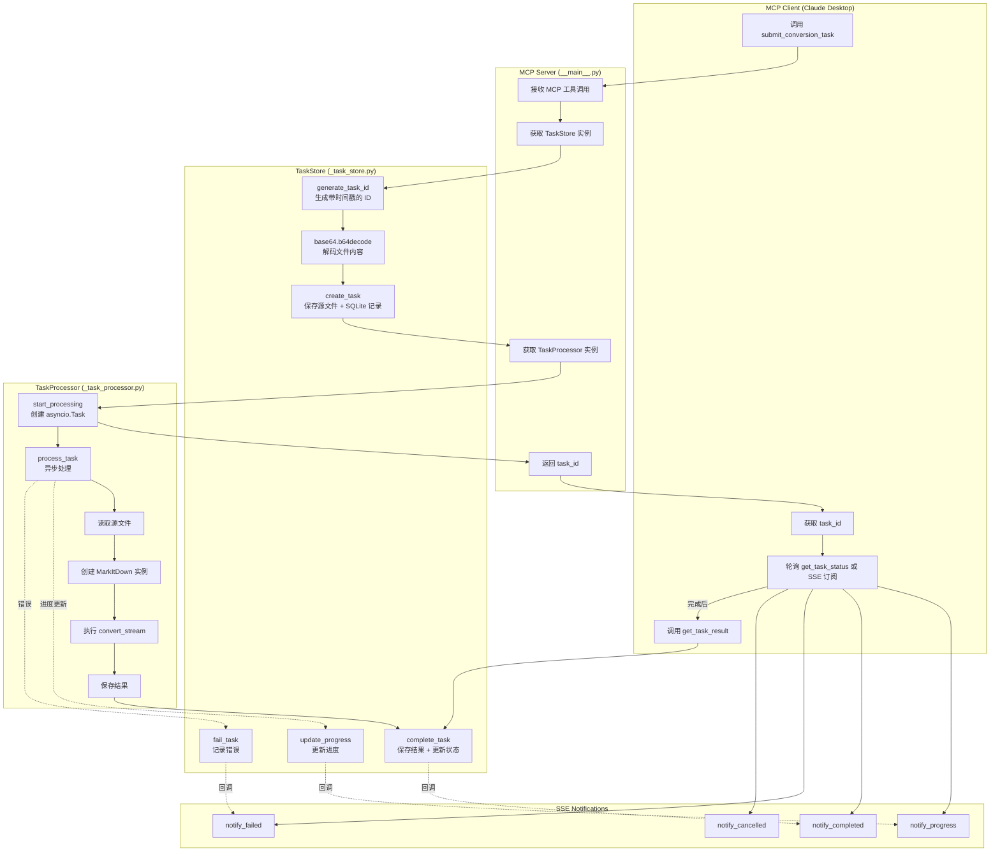
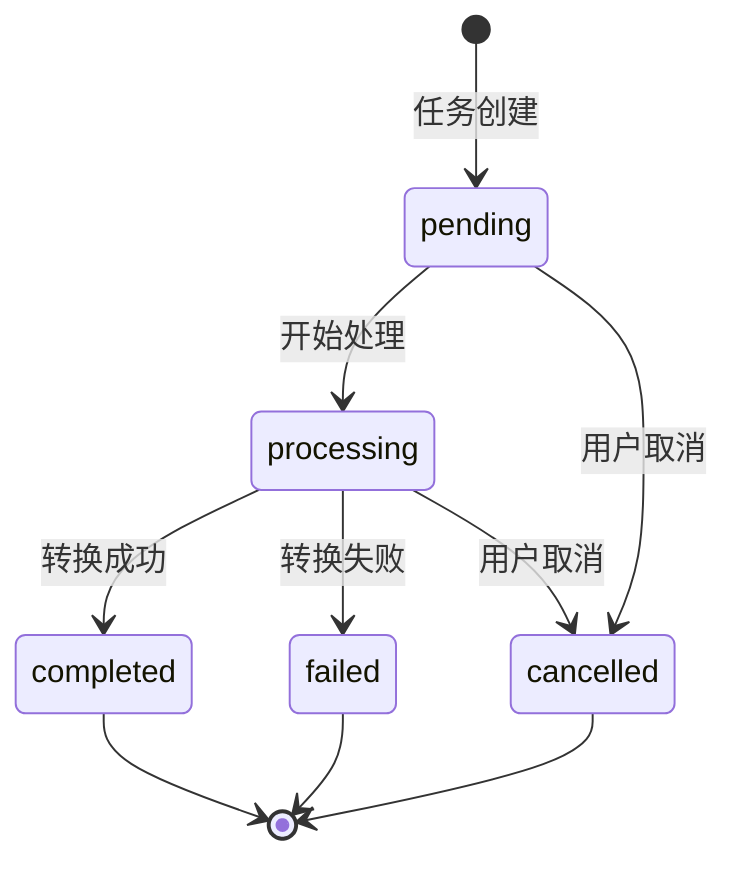
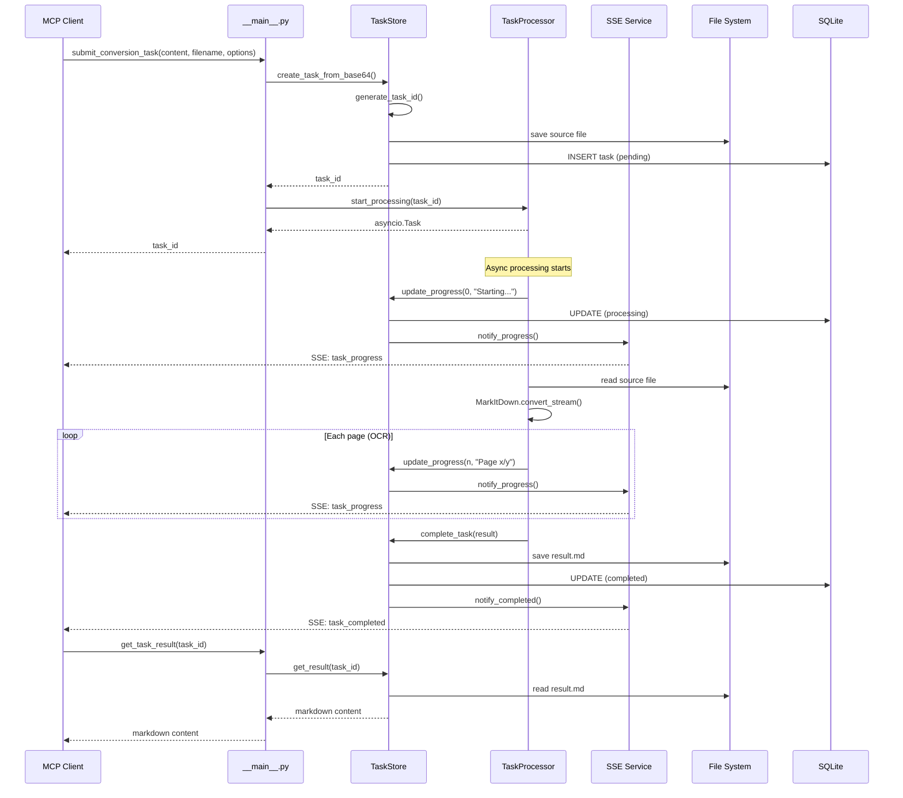
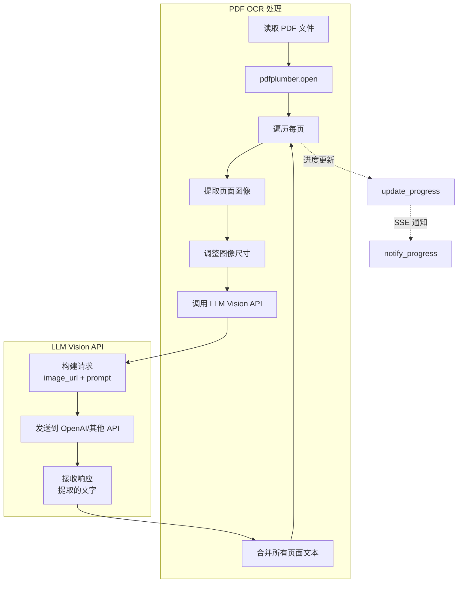

# MarkItDown OCR MCP 工作流程文档

## 1. 整体流程图



## 2. 详细步骤说明

### 步骤 1：提交任务

| 操作     | 组件                   | 说明                                                     |
| -------- | ---------------------- | -------------------------------------------------------- |
| 调用工具 | MCP Client             | `submit_conversion_task(content, filename, options)`   |
| 接收请求 | `__main__.py`        | MCP 工具装饰器处理                                       |
| 生成 ID  | `_task_store.py`     | `generate_task_id()` 生成 `task_lz1m2x3y4z5a6b7c8d9` |
| 解码内容 | `_task_store.py`     | `base64.b64decode(content)`                            |
| 保存文件 | `_task_store.py`     | 写入 `storage/2026/04/10/task_xxx_source.pdf`          |
| 创建记录 | `_task_store.py`     | SQLite INSERT，状态 `pending`                          |
| 启动处理 | `_task_processor.py` | `asyncio.create_task(process_task())`                  |
| 返回 ID  | `__main__.py`        | 返回 `task_id` 给客户端                                |

### 步骤 2：异步处理

| 操作     | 组件                      | 说明                                                             |
| -------- | ------------------------- | ---------------------------------------------------------------- |
| 更新状态 | `_task_processor.py`    | `update_progress(task_id, 0, "Starting...")` → `processing` |
| 读取文件 | `_task_processor.py`    | `open(task.source_path, 'rb')`                                 |
| 创建实例 | `_task_processor.py`    | `MarkItDown(enable_plugins=enable_ocr)`                        |
| 执行转换 | `_task_processor.py`    | `mid.convert_stream(file_stream, stream_info)`                 |
| OCR 处理 | `markitdown-ocr`        | 如果 `enable_ocr=True`，调用 LLM Vision                        |
| 保存结果 | `_task_store.py`        | `complete_task(task_id, result.markdown)`                      |
| 发送通知 | `_sse_notifications.py` | `notify_completed(task_id)`                                    |

### 步骤 3：获取结果

| 操作     | 组件               | 说明                             |
| -------- | ------------------ | -------------------------------- |
| 查询状态 | MCP Client         | `get_task_status(task_id)`     |
| 获取结果 | MCP Client         | `get_task_result(task_id)`     |
| 返回内容 | `_task_store.py` | 读取 `task_xxx_result.md` 文件 |

## 3. SSE 通知消息格式

### 3.1 事件类型列表

| 事件类型           | 触发时机 | 必需字段                               |
| ------------------ | -------- | -------------------------------------- |
| `task_progress`  | 进度更新 | `task_id`, `progress`, `message` |
| `task_completed` | 任务完成 | `task_id`, `status`, `progress`  |
| `task_failed`    | 任务失败 | `task_id`, `status`, `error`     |
| `task_cancelled` | 任务取消 | `task_id`, `status`                |

### 3.2 消息格式详解

#### task_progress（进度更新）

```json
{
  "event": "task_progress",
  "data": {
    "task_id": "task_lz1m2x3y4z5a6b7c8d9",
    "progress": 45,
    "message": "OCR processing page 5/10"
  }
}
```

**SSE 格式：**

```
event: task_progress
data: {"task_id":"task_lz1m2x3y4z5a6b7c8d9","progress":45,"message":"OCR processing page 5/10"}
```

#### task_completed（任务完成）

```json
{
  "event": "task_completed",
  "data": {
    "task_id": "task_lz1m2x3y4z5a6b7c8d9",
    "status": "completed",
    "progress": 100
  }
}
```

**SSE 格式：**

```
event: task_completed
data: {"task_id":"task_lz1m2x3y4z5a6b7c8d9","status":"completed","progress":100}
```

#### task_failed（任务失败）

```json
{
  "event": "task_failed",
  "data": {
    "task_id": "task_lz1m2x3y4z5a6b7c8d9",
    "status": "failed",
    "error": "OCR API timeout after 30 seconds"
  }
}
```

**SSE 格式：**

```
event: task_failed
data: {"task_id":"task_lz1m2x3y4z5a6b7c8d9","status":"failed","error":"OCR API timeout after 30 seconds"}
```

#### task_cancelled（任务取消）

```json
{
  "event": "task_cancelled",
  "data": {
    "task_id": "task_lz1m2x3y4z5a6b7c8d9",
    "status": "cancelled"
  }
}
```

**SSE 格式：**

```
event: task_cancelled
data: {"task_id":"task_lz1m2x3y4z5a6b7c8d9","status":"cancelled"}
```

### 3.3 SSE 订阅方式

**订阅特定任务：**

```
GET /tasks/events?task_id=task_lz1m2x3y4z5a6b7c8d9
```

**订阅所有任务：**

```
GET /tasks/events
```

**客户端示例（JavaScript）：**

```javascript
const eventSource = new EventSource('/tasks/events?task_id=task_xxx');

eventSource.addEventListener('task_progress', (e) => {
  const data = JSON.parse(e.data);
  console.log(`Progress: ${data.progress}% - ${data.message}`);
});

eventSource.addEventListener('task_completed', (e) => {
  const data = JSON.parse(e.data);
  console.log(`Task ${data.task_id} completed!`);
  eventSource.close();  // 完成后关闭连接
});

eventSource.addEventListener('task_failed', (e) => {
  const data = JSON.parse(e.data);
  console.error(`Task failed: ${data.error}`);
  eventSource.close();
});
```

## 4. 任务状态流转



### 状态说明

| 状态           | 说明                 | 可转换到                                 |
| -------------- | -------------------- | ---------------------------------------- |
| `pending`    | 任务已创建，等待处理 | `processing`, `cancelled`            |
| `processing` | 正在转换中           | `completed`, `failed`, `cancelled` |
| `completed`  | 转换完成，结果可获取 | 终态                                     |
| `failed`     | 转换失败，有错误信息 | 终态                                     |
| `cancelled`  | 用户取消             | 终态                                     |

## 5. 文件存储结构

```
storage/
├── tasks.db                      # SQLite 数据库
└── 2026/                          # 年份
    └── 04/                        # 月份
        └── 10/                    # 日期
            ├── task_lz1m2x_source_document.pdf    # 源文件
            ├── task_lz1m2x_result.md              # 结果文件
            ├── task_abc123_source_report.docx
            ├── task_abc123_result.md
            └── ...
```

### 文件命名规则

| 文件类型 | 格式                                     | 示例                                |
| -------- | ---------------------------------------- | ----------------------------------- |
| 源文件   | `{task_id}_source_{original_filename}` | `task_lz1m2x_source_document.pdf` |
| 结果文件 | `{task_id}_result.md`                  | `task_lz1m2x_result.md`           |

## 6. 数据库表结构

```sql
CREATE TABLE tasks (
    task_id TEXT PRIMARY KEY,           -- 任务 ID
    status TEXT DEFAULT 'pending',      -- 状态
    progress INTEGER DEFAULT 0,         -- 进度 0-100
    message TEXT,                       -- 进度消息
    created_at TIMESTAMP,               -- 创建时间
    updated_at TIMESTAMP,               -- 更新时间
    source_path TEXT,                   -- 源文件路径
    result_path TEXT,                   -- 结果文件路径
    options_json TEXT,                  -- 选项 JSON
    error_message TEXT                  -- 错误消息
);

CREATE INDEX idx_status ON tasks(status);
CREATE INDEX idx_created ON tasks(created_at);
```

## 7. MCP 工具参数格式

### submit_conversion_task

```json
{
  "content": "base64_encoded_file_content...",
  "filename": "document.pdf",
  "options": {
    "enable_ocr": true,
    "ocr_prompt": "Extract all text from this image",
    "ocr_model": "gpt-4o"
  }
}
```

**返回：**

```json
"task_lz1m2x3y4z5a6b7c8d9"
```

### get_task_status

```json
{
  "task_id": "task_lz1m2x3y4z5a6b7c8d9"
}
```

**返回：**

```json
{
  "task_id": "task_lz1m2x3y4z5a6b7c8d9",
  "status": "processing",
  "progress": 45,
  "message": "OCR processing page 5/10",
  "created_at": "2026-04-10T09:30:00",
  "updated_at": "2026-04-10T09:32:15"
}
```

### get_task_result

```json
{
  "task_id": "task_lz1m2x3y4z5a6b7c8d9"
}
```

**返回：**

```markdown
# Document Title

Content extracted from the document...
```

### cancel_task

```json
{
  "task_id": "task_lz1m2x3y4z5a6b7c8d9"
}
```

**返回：**

```json
true  // 或 false（如果任务已完成或不存在）
```

### list_tasks

```json
{
  "status": "processing",
  "limit": 10
}
```

**返回：**

```json
[
  {
    "task_id": "task_lz1m2x3y4z5a6b7c8d9",
    "status": "processing",
    "progress": 45,
    "message": "OCR processing page 5/10",
    "created_at": "2026-04-10T09:30:00",
    "updated_at": "2026-04-10T09:32:15"
  },
  ...
]
```

### get_supported_formats

**参数：** 无

**返回：**

```json
[
  {"extension": ".pdf", "mimetype": "application/pdf", "ocr_support": true},
  {"extension": ".docx", "mimetype": "application/vnd.openxmlformats-officedocument.wordprocessingml.document", "ocr_support": true},
  {"extension": ".xlsx", "mimetype": "application/vnd.openxmlformats-officedocument.spreadsheetml.sheet", "ocr_support": true},
  {"extension": ".pptx", "mimetype": "application/vnd.openxmlformats-officedocument.presentationml.presentation", "ocr_support": true},
  {"extension": ".jpg", "mimetype": "image/jpeg", "ocr_support": true},
  {"extension": ".png", "mimetype": "image/png", "ocr_support": true},
  ...
]
```

## 8. 错误处理

### 任务未找到

```json
{
  "error": "Task not found"
}
```

### 任务未完成

```json
{
  "error": "Task status is 'processing', not 'completed'"
}
```

### Base64 解码失败

```json
{
  "error": "Invalid Base64 content"
}
```

### OCR API 错误

```json
{
  "event": "task_failed",
  "data": {
    "task_id": "task_xxx",
    "status": "failed",
    "error": "OCR API error: Rate limit exceeded"
  }
}
```

## 9. 时序图



## 10. OCR 处理详细流程



### OCR 进度计算

| 阶段     | 进度范围 | 说明                 |
| -------- | -------- | -------------------- |
| 初始化   | 0-5%     | 读取 PDF，检测页数   |
| 页面提取 | 5-10%    | 提取每页图像         |
| OCR 处理 | 10-95%   | 每页 OCR（主要时间） |
| 合并结果 | 95-100%  | 合并所有页面文本     |

**进度公式：**

```python
# OCR 部分占 85% 的进度
ocr_progress = 10 + int(page_num / total_pages * 85)
message = f"OCR processing page {page_num}/{total_pages}"
```

---

## 附录：相关文件

| 文件     | 路径                                                                         | 说明              |
| -------- | ---------------------------------------------------------------------------- | ----------------- |
| MCP 入口 | `packages/markitdown-ocr-mcp/src/markitdown_ocr_mcp/__main__.py`           | MCP 工具定义      |
| 任务存储 | `packages/markitdown-ocr-mcp/src/markitdown_ocr_mcp/_task_store.py`        | SQLite + 文件管理 |
| 任务处理 | `packages/markitdown-ocr-mcp/src/markitdown_ocr_mcp/_task_processor.py`    | 异步转换处理      |
| SSE 通知 | `packages/markitdown-ocr-mcp/src/markitdown_ocr_mcp/_sse_notifications.py` | 实时通知服务      |
| OCR 插件 | `packages/markitdown-ocr/src/markitdown_ocr/_pdf_converter_with_ocr.py`    | PDF OCR 转换器    |
